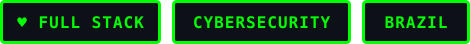
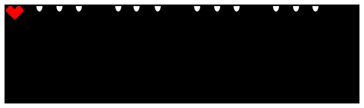
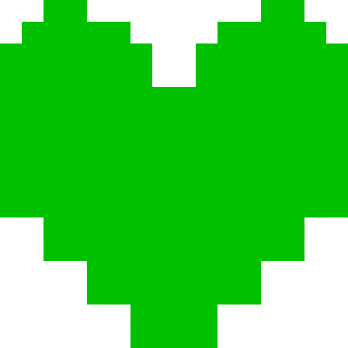
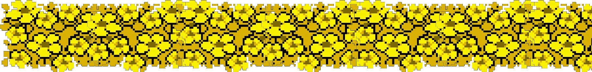

  

  

<h3 align="center">Full Stack Developer</h3>

  Building web &amp; mobile experiences • Studying cybersecurity

  

 

---

## About Me

Biomedical Informatics student, working mostly on **frontend**  
Studying **cybersecurity** — vulnerability analysis and secure development  
Happy to talk about **cybersecurity** and **games**

---

## Tech Stack

<table>
  <tr>
    <td align="right"><b>Frontend</b></td>
    <td>
      
      
      
      
    </td>
  </tr>
  <tr>
    <td align="right"><b>Backend</b></td>
    <td>
      
      
      
    </td>
  </tr>
  <tr>
    <td align="right"><b>Mobile</b></td>
    <td>
      
      
      
    </td>
  </tr>
  <tr>
    <td align="right"><b>Tools &amp; Cloud</b></td>
    <td>
      
      
      
      
    </td>
  </tr>
</table>

  

---

  

---

## Connect with me

  
  
  

  
  

